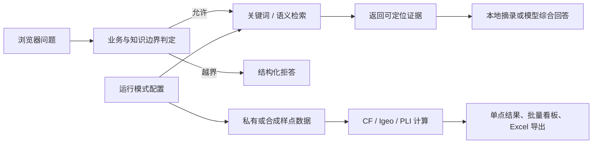

# SoilLens 工程说明

## 两种运行模式

| 模式 | 文档库 | 样点 Excel | 访问规则 | 适合场景 |
| --- | --- | --- | --- | --- |
| `private`（默认） | 项目根目录中的本机 PDF | `private_data/Sample_hms.xlsx` | 真实样点接口仅允许本机浏览器 | 个人研究与论文分析 |
| `demo` | `demo_data/documents/` 中的原创材料 | `demo_data/Sample_demo.xlsx` | 可供远程演示，全部为合成数据 | GitHub、Docker、面试展示 |

运行模式在程序启动时确定。公开模式不会回退读取 `private_data/` 或项目根目录 PDF；
Docker 镜像也只复制 `app/`、`web/` 和 `demo_data/`，形成第二道隔离。

## 请求链路

## 可验证性

- `/api/health`：返回版本、运行模式、索引状态、文档数和语义检索状态。
- `tests/test_demo_profile.py`：验证公开目录隔离、原创文档索引、合成样点、部分元素输入和 Docker 排除规则。
- `.github/workflows/ci.yml`：运行计算、隐私和公开模式测试，构建 Docker 镜像并请求健康检查。
- `.dockerignore` 与 Dockerfile 显式复制白名单共同阻止真实 Excel、研究 PDF 和缓存进入镜像。

## 公开前检查

1. 公开仓库只提交源码、`demo_data/`、测试和说明文档。
2. 不提交根目录 PDF、`background_values/`、`private_data/`、`.env`、缓存或模型文件。
3. 检查网页顶部是否显示“公开合成演示模式”。
4. 检查 `/api/health` 中 `profile` 是否为 `demo`。
5. 随机查看样点编号，确认全部以 `DEMO-` 开头。

